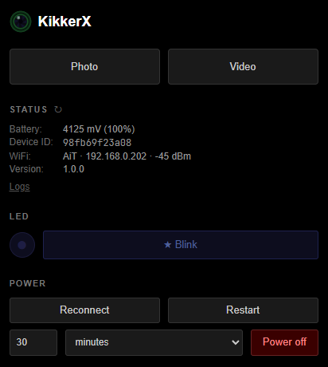
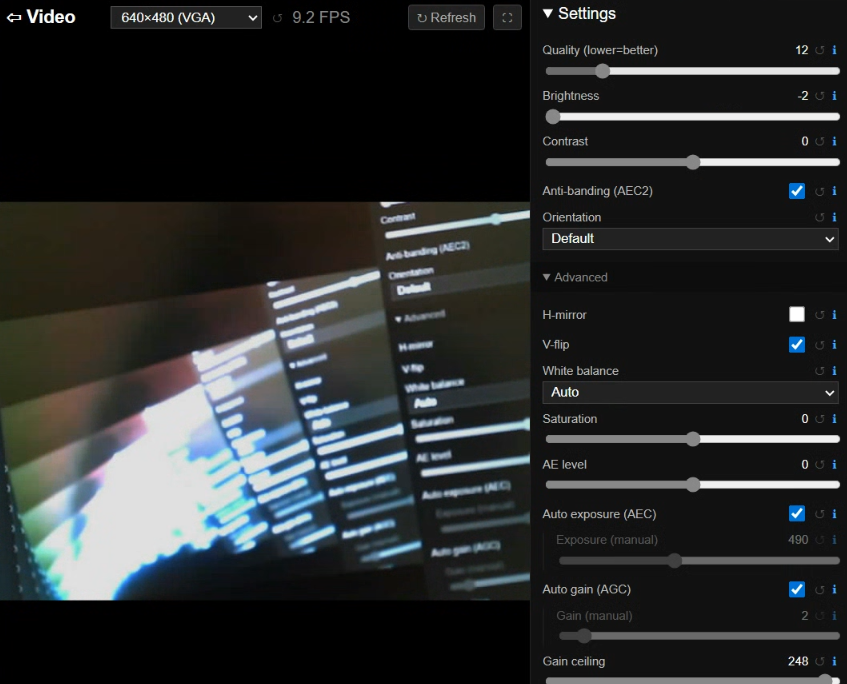
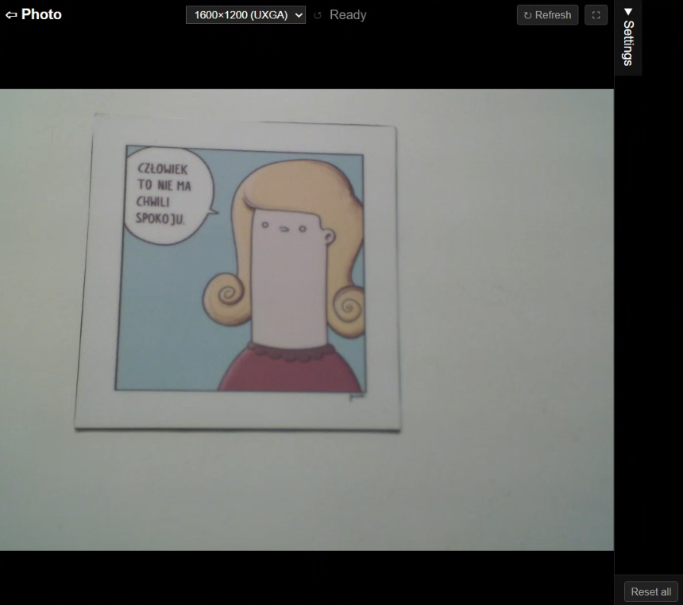
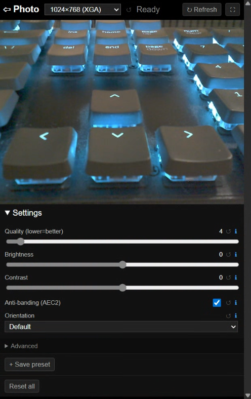
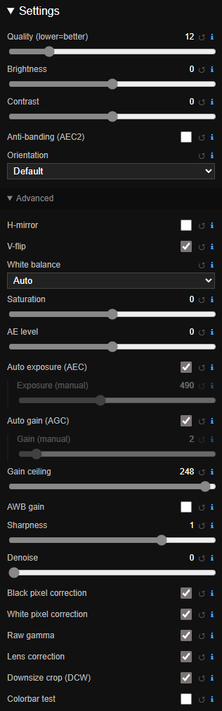

# KikkerX


Wi-Fi camera server firmware for the [M5Stack Timer Camera X](https://docs.m5stack.com/en/unit/timercam_x). Streams live
MJPEG video, serves full-resolution still photos, and provides a self-contained web interface — all over plain HTTP with
no app or cloud required.

---

## Hardware

- **[M5Stack Timer Camera X](https://docs.m5stack.com/en/unit/timercam_x)** — ESP32-based board with an OV3660 image
  sensor (up to 1600×1200), built-in LiPo charger, BM8563 RTC for timed sleep, and a blue status LED.

---

## Features

- **Live MJPEG stream** at any supported resolution (QQVGA → UXGA), served as a standard `multipart/x-mixed-replace`
  response — viewable in any browser or with `ffplay`, `mpv`, etc.
- **Still capture** at up to 1600×1200 (UXGA), with automatic exposure settling.
- **Full OV3660 settings panel** (brightness, contrast, saturation, sharpness, white balance, exposure, gain, lens
  correction, …) shared across the stream and photo pages.
- **Simultaneous stream + capture**: a photo taken while streaming pauses the stream at a frame boundary, captures with
  its own settings, then resumes — no dropped stream connection.
- **Blue LED control**: toggle on/off, or send a one-off arbitrary blink pattern.
- **Timed sleep / power-off**: sleep for a set time, or permanently.
- **WiFi roaming**: connect to the strongest known network, with automatic reconnect on drop.
- **Fallback to access point**: if no known network is reachable, starts a soft access point so the device remains
  reachable; switches back to station mode automatically when a known network reappears.
- **mDNS**: reachable at `http://kikker-x.local/` or a custom hostname.
- **Basic auth** (optional): username + SHA-256-hashed password in the config file.
- **Mobile-friendly UI**: responsive layout that works well on phones and tablets.

<table>
  <tr>
    <td valign="top">
      <a href="docs/screenshots/main.png"></a><br>
      <a href="docs/screenshots/video.png"></a><br>
      <a href="docs/screenshots/photo.png"></a><br>
      <a href="docs/screenshots/mobile.png"></a>
    </td>
    <td valign="top">
      <a href="docs/screenshots/settings.png"></a>
    </td>
  </tr>
</table>

---

## AI usage and engineering standard

This project is developed with the assistance of AI tools, including Claude Code, Gemini and GitHub Copilot. The main
engineer behind the project is me — a human engineer with 20+ years of professional IT experience. I design the
architecture, and yes, I read and approve all the code, and write some of it. This project is by no means "AI slop" —
the AI was used as a power tool, not as the brain. (And emdashes do look nicer, I copied and pasted them in this
paragraph. And the initial commit is huge because the project was developed for a long time and I just squashed
everything at v1.)

---

## Getting started

### 1. Install tooling

#### - PlatformIO

Install [PlatformIO](https://platformio.org/install) — either the CLI or the VS Code extension. Required for building
and flashing the firmware.

#### - uv (optional)

[uv](https://docs.astral.sh/uv/) is needed if you want to:

- Use the **[video recorder](#recording-to-video)** (`./video_saver.py`)
- Do **development** — run the fake server (`./fake_server.py`) or format/lint checks (`./format.sh`, `./checks.sh`)

If you only want to build and flash the firmware, you can skip this. Python 3.11 or higher is required (also by the
PlatformIO build scripts).

To install **uv**:

```sh
curl -LsSf https://astral.sh/uv/install.sh | sh
```

Then install Python dependencies:

```sh
uv sync
```

**WSL note:** uv may warn about falling back to full copy instead of hardlinks. This is expected when the uv cache and
the project are on different filesystems. To suppress it, set
[`UV_LINK_MODE=copy`](https://docs.astral.sh/uv/reference/environment/) in your shell profile:

```sh
echo 'export UV_LINK_MODE=copy' >> ~/.bashrc   # or ~/.zshrc
```

### 2. Configure

All configuration lives in a single JSON file embedded into the firmware as assets at build time. The template at
`configs/config.json.template` documents all fields.

For a single device, the quickest path is to add a config file under `configs/custom/` (gitignored) and point the build
at it. See `configs/README.md` for the full workflow, including multi-device setups.

A minimal config looks like:

```json
{
  "mdns": "kikker-x",
  "known_networks": [
    { "ssid": "HomeNet", "password": "hunter2" },
    { "ssid": "PhoneHotspot", "password": "hunter3" }
  ],
  "fallback_access_point": {
    "ssid": "KikkerX",
    "password": "changeme"
  },
  "auth": null
}
```

The device connects to the strongest visible network from `known_networks`. Multiple entries are useful for roaming e.g.
between home and a phone hotspot.

If no known network is reachable after three scan attempts, the device starts a soft access point using the
`fallback_access_point` credentials. Connect to it and browse to `http://192.168.4.1/` to reach the web interface. The
device scans every 5 minutes while in AP mode and switches back to station mode automatically once a known network
becomes visible again.

Set `"fallback_access_point": null` to disable the fallback — the device will then retry indefinitely instead of
starting an AP.

If `known_networks` is empty, the device goes straight to AP mode without scanning.

Optional static IP per network entry:

```json
{
  "ssid": "HomeNet",
  "password": "hunter2",
  "static_ip": "192.168.1.50",
  "subnet_mask": "255.255.255.0",
  "gateway": "192.168.1.1",
  "dns": "8.8.8.8"
}
```

**Authentication** — set a username and a SHA-256 hash of the password. You can calculate the hash with
`IFS= read -rsp 'Password: ' pass && echo && printf '%s' "$pass" | sha256sum | cut -d' ' -f1; unset pass`. Paste the
resulting hash into `pass_sha256`. To disable auth entirely, set `"auth": null`.

**mDNS hostname** — set `"mdns"` to the full hostname you want:

```json
{ "mdns": "kikker-x-garden" }
```

This device will then be reachable at `http://kikker-x-garden.local/`.

### 3. Build and flash

The default environment uses `configs/default_config.json`:

```sh
pio run --target upload
```

To build for a specific camera, pass its environment name with `-e`. Custom environments are defined in
`configs/platformio.ini` (see `configs/platformio.ini.template` and `configs/README.md`):

```sh
pio run -e kikker-x-garden --target upload
```

Watch the serial output for the assigned IP address:

```sh
pio device monitor
```

---

## Web interface

Open `http://kikker-x.local/` (or the configured mDNS hostname, shown also in the serial log at startup).

| Page  | URL      | Description                                  |
| ----- | -------- | -------------------------------------------- |
| Home  | `/`      | Status, battery, WiFi, LED, power management |
| Video | `/video` | Live MJPEG stream + settings panel           |
| Photo | `/photo` | Still capture + settings panel               |
| Logs  | `/logs`  | Scrollable in-memory log buffer              |

The settings panel on the Video and Photo pages exposes all OV3660 sensor parameters.

The advanced panel shows also the URL of the raw stream or capture endpoint with the currently selected parameters —
useful for copy-pasting into scripts. See the API section below for details.

---

## API

All endpoints are plain HTTP. If authentication is enabled, pass credentials with every request using HTTP Basic auth:

```sh
curl -u admin "http://kikker-x.local/api/status"
# curl will prompt for the password
```

Or inline (less safe — visible in shell history):

```sh
curl -u admin:password "http://kikker-x.local/api/status"
```

The examples below omit `-u` for brevity; add it if auth is enabled. Use `--fail-with-body` to get a non-zero exit code
and a visible error on auth failures or other HTTP errors.

### Status

```sh
curl "http://kikker-x.local/api/status"
# → { "battery": { "voltage": 3850, "level": 75 },
#      "id": "c0ffeefacade",
#      "wifi": { "mode": "station", "ssid": "HomeNet", "ip": "192.168.1.50", "rssi": -52 },
#      "version": "1.0.0" }
```

In AP mode `wifi.mode` is `"ap"`, `ssid` and `ip` reflect the soft AP, and `rssi` is absent.

### Camera

```sh
curl "http://kikker-x.local/api/cam/stream.mjpeg?res=VGA&quality=12&brightness=0" --output stream.mjpeg
```

Returns a `multipart/x-mixed-replace` MJPEG stream. Supported resolutions: `QQVGA` (160×120), `QVGA` (320×240), `CIF`
(400×296), `VGA` (640×480), `SVGA` (800×600), `XGA` (1024×768), `SXGA` (1280×1024), `UXGA` (1600×1200).

```sh
curl "http://kikker-x.local/api/cam/capture.jpg?res=UXGA&quality=4" --output photo.jpg
```

Returns a single JPEG still. Defaults to UXGA and quality 4 (high). Accepts the same sensor parameters as the stream.
Add `raw=1` to apply only the parameters explicitly present in the URL (useful for scripted capture).

```sh
curl "http://kikker-x.local/api/streamfps"
# → { "fps": 9.4, "active": true }
```

### LED

```sh
curl "http://kikker-x.local/api/led"
# → { "state": false }

curl -X PATCH "http://kikker-x.local/api/led" -H "Content-Type: application/json" -d '{"state": true}'
# → { "state": true }

curl -X POST "http://kikker-x.local/api/led/blink" -H "Content-Type: application/json" -d '{"pattern": "200,200,200,200,200"}'
```

The blink pattern is a comma-separated list of millisecond durations (on, off, on, off, …). Total must not exceed 5000
ms. The LED returns to its previous state afterwards.

### Power

```sh
curl -X POST "http://kikker-x.local/api/poweroff?duration=0"        # permanent power-off
curl -X POST "http://kikker-x.local/api/poweroff?duration=3600"     # sleep for 1 hour
curl -X POST "http://kikker-x.local/api/restart"                    # reboot the device
```

`duration=0` powers off permanently. Any other value (in seconds) puts the device into RTC-timed deep sleep using the
BM8563 RTC, and it wakes automatically after `N` seconds. Maximum sleep duration is 15,300 seconds (4 hours and 15
minutes). Values above that are clamped.

`/api/restart` performs a clean software reboot (`ESP.restart()`). The device responds with `200 OK` before rebooting,
so the response confirms the request was received.

### WiFi

```sh
curl -X POST "http://kikker-x.local/api/wifi/reconnect"
```

Responds immediately, then waits 3 seconds and reconnects — selecting the strongest visible known network. Useful for
roaming to a different access point. Also works in AP mode to force an immediate attempt to join a known network.

### Logs

```sh
curl "http://kikker-x.local/api/logs"   # plain-text in-memory log buffer
```

---

## Recording to video

`video_saver.py` records the MJPEG stream or a timelapse to H.264 MP4 files using `ffmpeg`.

Requires `ffmpeg` with libx264 (most distributions ship this). Python dependencies are managed with
[uv](https://docs.astral.sh/uv/) — see [Getting started](#getting-started).

Always quote the URL — the `?` and `&` in query strings are shell metacharacters and will be misinterpreted if unquoted.

**Stream recording** — records live MJPEG, rolling to a new file every hour:

```sh
./video_saver.py \
    "http://kikker-x.local/api/cam/stream.mjpeg?res=VGA" \
    --output-dir ./recordings
```

**Stream at 5 fps, high compression, roll every 500 MB:**

```sh
./video_saver.py \
    "http://kikker-x.local/api/cam/stream.mjpeg?res=SVGA" \
    --output-dir ./recordings \
    --fps-cap 5 --quality 28 --encode-preset slow --roll-size-mb 500
```

**Timelapse** — one frame every 30 seconds, new file every 24 hours:

```sh
./video_saver.py \
    "http://kikker-x.local/api/cam/capture.jpg?res=UXGA" \
    --output-dir ./timelapse \
    --timelapse-interval 30s \
    --roll-interval 24h
```

**One week timelapse with auth, roll at 500 MB:**

```sh
./video_saver.py \
    "http://kikker-x.local/api/cam/capture.jpg?res=UXGA" \
    --output-dir ./timelapse \
    --timelapse-interval 1m \
    --total-time 7d \
    --roll-size-mb 500 \
    --auth-user admin
```

#### Battery-saving timelapse

Pass `--timelapse-sleep-url` to POST a URL after each successful capture — typically `/api/poweroff?duration=N` — to put
the device into timed deep sleep between frames. Use `{{interval}}` in the URL as a placeholder; it is replaced with the
sleep duration in seconds (`--timelapse-interval` minus `--timelapse-sleep-margin`).

```sh
./video_saver.py \
    "http://kikker-x.local/api/cam/capture.jpg?res=UXGA" \
    --output-dir ./timelapse \
    --timelapse-interval 5m \
    --roll-interval 24h \
    --timelapse-sleep-url "http://kikker-x.local/api/poweroff?duration={{interval}}" \
    --timelapse-sleep-margin 30s
```

This example sleeps for 270 s (5 min − 30 s), leaving 30 s for boot and WiFi reconnect. The script's retry logic handles
the device being temporarily unreachable while it sleeps; `--timelapse-interval` acts as a minimum gap between frames —
if the device comes up early the script waits out the remainder.

#### Flags

| Flag                       | Default | Description                                             |
| -------------------------- | ------- | ------------------------------------------------------- |
| `--output-dir`             | —       | Directory for output files (required)                   |
| `--roll-interval`          | `1h`    | Start a new file after this duration                    |
| `--total-time`             | —       | Stop after this total time                              |
| `--roll-size-mb`           | —       | Also roll when file exceeds N MB                        |
| `--quality`                | `23`    | H.264 CRF (lower = better quality, larger file)         |
| `--encode-preset`          | `fast`  | `ultrafast` … `veryslow`                                |
| `--fps-cap`                | —       | [stream] Drop frames to stay at or below N fps          |
| `--timelapse-interval`     | —       | [timelapse] Capture interval                            |
| `--timelapse-fps`          | `25`    | [timelapse] Playback frame rate of output video         |
| `--timelapse-sleep-url`    | —       | [timelapse] URL to POST after each frame (device sleep) |
| `--timelapse-sleep-margin` | `0s`    | [timelapse] Subtracted from interval for `{{interval}}` |
| `--connect-timeout`        | `10`    | Timeout in seconds for the initial HTTP connection      |
| `--read-timeout`           | `30`    | Timeout in seconds for receiving data; triggers a retry |
| `--retry-delay`            | `2s`    | Initial wait before retrying after an error             |
| `--max-retry-delay`        | `1m`    | Exponential backoff cap for retry delay                 |
| `--auth-user`              | —       | HTTP Basic auth username                                |
| `--auth-password`          | —       | HTTP Basic auth password (prompted if omitted)          |
| `--status-url`             | —       | URL to fetch periodically and log alongside recordings  |
| `--status-interval`        | `10m`   | How often to fetch `--status-url`                       |
| `--debug`                  | —       | Print per-frame timing events to stdout                 |

Press Ctrl-C to stop cleanly — the current segment is finalized before exit.

---

## Development server

`fake_server.py` serves the static UI from `src/static/` and simulates all API endpoints — no hardware needed.

```sh
./fake_server.py          # http://localhost:8080/
./fake_server.py 9000     # custom port
```

`/api/restart` re-executes the server process. `/api/poweroff` shuts it down.

---

## Repository layout

| Path                                                          | Description                                                                   |
| ------------------------------------------------------------- | ----------------------------------------------------------------------------- |
| `src/`                                                        | The firmware source code                                                      |
| &nbsp;&nbsp;&nbsp;&nbsp;&nbsp;&nbsp;`kikker-x.cpp`            | Main firmware (HTTP server, camera, LED, power)                               |
| &nbsp;&nbsp;&nbsp;&nbsp;&nbsp;&nbsp;`static/`                 | Web assets (HTML, CSS, JS, SVG)                                               |
| &nbsp;&nbsp;&nbsp;&nbsp;&nbsp;&nbsp;`_config.json`            | Generated at build time by `prepare_config.py` (merged from configured files) |
| &nbsp;&nbsp;&nbsp;&nbsp;&nbsp;&nbsp;`_static_files.h`         | Generated at build time by `embed_static.py` (from `src/static/*`)            |
| &nbsp;&nbsp;&nbsp;&nbsp;&nbsp;&nbsp;`_version.h`              | Generated at build time by `generate_version.py` (from `pyproject.toml`)      |
| `configs/`                                                    | Configuration files                                                           |
| &nbsp;&nbsp;&nbsp;&nbsp;&nbsp;&nbsp;`config.json.template`    | Documents all config fields with comments                                     |
| &nbsp;&nbsp;&nbsp;&nbsp;&nbsp;&nbsp;`default_config.json`     | Default config (no WiFi, AP fallback enabled, no auth)                        |
| &nbsp;&nbsp;&nbsp;&nbsp;&nbsp;&nbsp;`platformio.ini`          | Local PlatformIO overrides — not committed (see template)                     |
| &nbsp;&nbsp;&nbsp;&nbsp;&nbsp;&nbsp;`platformio.ini.template` | Template for multi-device configs                                             |
| &nbsp;&nbsp;&nbsp;&nbsp;&nbsp;&nbsp;`README.md`               | Config system documentation                                                   |
| &nbsp;&nbsp;&nbsp;&nbsp;&nbsp;&nbsp;`custom/`                 | Per-device config files — not committed (gitignored)                          |
| `build_helpers/`                                              | Build scripts                                                                 |
| &nbsp;&nbsp;&nbsp;&nbsp;&nbsp;&nbsp;`generate_version.py`     | PlatformIO pre-script: reads version from `pyproject.toml` → `src/_version.h` |
| &nbsp;&nbsp;&nbsp;&nbsp;&nbsp;&nbsp;`embed_static.py`         | PlatformIO pre-script: embeds `src/static/*` into firmware                    |
| &nbsp;&nbsp;&nbsp;&nbsp;&nbsp;&nbsp;`prepare_config.py`       | PlatformIO pre-script: merges config files → `src/_config.json`               |
| `fake_server.py`                                              | Development HTTP server (no hardware needed)                                  |
| `video_saver.py`                                              | MJPEG/timelapse recorder → H.264 MP4                                          |
| `format.sh`                                                   | Formats C++, JS/HTML/CSS, Python, and Markdown                                |
| `checks.sh`                                                   | Lints and type-checks JS/HTML/CSS and Python                                  |
| `platformio.ini`                                              | PlatformIO project configuration                                              |
| `LICENSE`                                                     | MIT License                                                                   |

---

## Development

**Format** — clang-format (C++), Biome (JS/HTML/CSS), ruff (Python), prettier (Markdown):

```sh
./format.sh
```

**Check** — Biome lint (JS/HTML/CSS), ruff check (Python), mypy (Python):

```sh
./checks.sh
```

---

## License

MIT — see [LICENSE](LICENSE). Copyright (c) 2026 TPReal.
