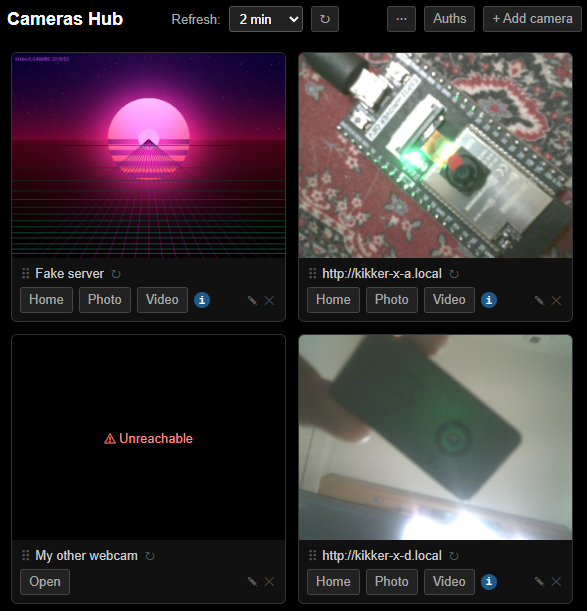

# Cameras Hub

The Cameras Hub is a multi-camera dashboard that shows thumbnails, links, and status for any number of KikkerX (or
other) cameras. It runs either embedded on every KikkerX device, or as a standalone server on any machine on the
network.

<a href="screenshots/hub.png"></a>

---

## Standalone server

`cameras_hub.py` serves just the hub page — no camera hardware needed. Any machine on the local network can run it.

```sh
python cameras_hub.py               # http://localhost:8765/
python cameras_hub.py --port 8080   # custom port
```

### Loading a cameras config

Pass a JSON file to pre-populate the hub with cameras on load:

```sh
python cameras_hub.py --store cameras_store.json
```

The file uses the same JSON format as the hub's **Export** (see [Import / Export](#import--export) below). On startup,
the server merges the file into the browser's local storage. Edits stay local unless the user explicitly saves via
**Save to server** (requires write credentials).

The file is created on first save if it does not yet exist, if `--auth-write-user` is configured.

### Authentication

If the `--store` file is specified, two sets of credentials control access to it. Use `"*"` as the username to allow
that operation without credentials.

| Flag                               | Controls                                   | If not specified |
| ---------------------------------- | ------------------------------------------ | ---------------- |
| `--auth-user` / `…-password`       | Who may **read** the store file.           | Open read access |
| `--auth-write-user` / `…-password` | Who may **read and write** the store file. | No write access  |

Both flags may use different credentials, or the same — if the read and write credentials match, a single login grants
both, and password is configured by `--auth-password`.

Passwords can be supplied as a literal value, read from a file with `@/path/to/file`, read from stdin with `@-`, or
prompted interactively when running in a terminal (omit the password flag entirely).

```sh
# Public read, authenticated write:
python cameras_hub.py --store cameras_store.json \
  --auth-write-user admin --auth-write-password secret

# Protected read and write, same credentials (--auth-write-password omitted — password is shared):
python cameras_hub.py --store cameras_store.json \
  --auth-user admin --auth-password secret \
  --auth-write-user admin

# Protected read and write, separate credentials:
python cameras_hub.py --store cameras_store.json \
  --auth-user viewer --auth-password viewpass \
  --auth-write-user admin --auth-write-password adminpass

# Public read and write (no credentials):
python cameras_hub.py --store cameras_store.json \
  --auth-write-user "*"
```

Credentials are not stored in a persistent session. When the page loads it fetches the store; if credentials are
required a dialog appears. On cancel the page runs from local browser storage only. When saving, credentials are
prompted if not yet provided. Credentials are cached in memory and cleared on page refresh.

**Note:** Password-protecting the hub does not secure access to the cameras.

---

## Embedded hub

The hub is also embedded in the KikkerX firmware and served from the device under the `/hub` path. It does not allow
saving the configuration permanently, but more cameras can be added and stored in browser local storage.

If auth is configured on the device, the hub pre-populates an auth entry with the username so that the password prompt
is pre-filled when credentials are needed (e.g. after importing the exported config on another hub).

---

## Camera types

### KikkerX

Add a KikkerX camera by entering its base URL (e.g. `http://kikker-x-garden.local`). The hub links to its Home, Photo,
and Video pages and fetches thumbnails from `/api/cam/capture.jpg`.

**Capture params** — optional query parameters appended to the thumbnail and capture URL, e.g. `aec2=1`. Useful to avoid
requesting a full-resolution image for every refresh.

**Status tooltip** — the hub fetches `/api/status` for each KikkerX camera and shows a small **i** button with WiFi and
battery info on hover.

### Other

Add any camera that exposes a direct JPEG or MJPEG snapshot URL. The hub shows the thumbnail and a single "Open" link.

---

## Cameras authentication

The hub supports HTTP Basic auth for cameras that require credentials.

**Saved auths** are stored in the browser's local storage (or in the server file when using **Save to server**). An auth
entry has an optional name, a username, and an optional password. If password is missing, it is prompted on the hub page
when needed. Multiple cameras can share the same saved auth. Manage saved auths from the **Auths** button in the
toolbar.

**Session credentials** — if a camera returns 401 or 403, an inline prompt appears on its card. Enter credentials and
click **Use** to apply them for the current page session only, or **Save** to persist them in the local storage.

---

## Import / Export

Use **Export** and **Import** to transfer your camera list between browsers or to back it up.

The exported JSON format (passwords are encoded as `\uXXXX` Unicode escapes):

```json
{
  "version": 1,
  "cameras": [
    {
      "url": "http://garden.local",
      "type": "kikker-x",
      "name": "Garden",
      "authId": null
    }
  ],
  "auths": [
    {
      "id": "...",
      "name": "Home network",
      "username": "admin",
      "password": "\u0073\u0065\u0063\u0072\u0065\u0074"
    }
  ]
}
```

When importing, tick **Replace all** to overwrite the current list; unticked (default) merges — cameras with the same
URL and type are skipped.

---

## CORS

Browsers block cross-origin `fetch()` requests unless the server sends `Access-Control-Allow-Origin` headers. KikkerX
firmware sends these headers by default; many other cameras do not.

The hub uses `fetch()` for thumbnails and status — cameras that don't send CORS headers will show as unreachable in the
hub. The camera's own page still works when opened directly via the card's "Open" link. Disabling CORS on a KikkerX
camera (`"allow_cors": false` in the config) produces the same result: the card shows as unreachable in the hub.

The reverse proxy (`--enable-proxy`, see below) sidesteps this: it re-hosts camera responses under the hub's origin with
its own CORS headers, so cameras are reachable even without native CORS support.

---

## Reverse proxy (`--enable-proxy`)

When the hub is exposed through a single tunnel or VPN but the cameras aren't directly reachable by remote clients (the
classic "I VPN'd to my home network but only the hub's port is forwarded" problem), the standalone hub can act as a
reverse proxy for each camera.

```sh
python cameras_hub.py --store cameras.json --enable-proxy
```

With `--enable-proxy`:

- One local listener is opened per distinct camera origin (OS-assigned port). The ports aren't stable across restarts.
- When a camera is added or removed via `PUT /api/hub/store`, the listener set is reconciled.
- The listeners forward every request verbatim — method, path, query, headers, body — to the upstream camera, and stream
  responses back (MJPEG/multipart-safe; TCP_NODELAY on both legs). The client's `Authorization` header is passed through
  unchanged.
- **mDNS names (`*.local`) are resolved once at listener creation and the IP is cached**, avoiding a lookup on every
  request. A connection failure triggers one automatic re-resolve + retry, so a DHCP renewal or brief camera outage
  doesn't require restarting the hub.
- `/api/hub/status` advertises the port map as `proxy: { ports: { "http://cam1": 54321, ... } }`.
- The hub page shows a **Proxy through hub** checkbox in the `⋯` menu (only when the server offers it) and a small "via
  proxy" badge in the header while it's active. The UI keeps displaying and editing original camera URLs; only
  thumbnails, card links, and status requests target the proxy when the checkbox is on. Default on; remembered via
  `pageOptions.hubProxy` in localStorage.

Constraints:

- **HTTP only.** The proxy listeners serve plain HTTP. If the hub's main page is served over HTTPS (e.g. a terminating
  reverse proxy), the browser blocks mixed content; turn the proxy off or arrange matching HTTPS termination for the
  random ports too.
- **One port per origin.** All ports must be reachable by the client — this fits a VPN or LAN-wide tunnel, but not a
  single-hostname tunnel (e.g. cloudflared).
- **Auth pass-through.** The hub doesn't decrypt or manage camera credentials on the client's behalf. Whatever
  `Authorization` the client sends to the proxy port is forwarded; no credentials are stored on the server beyond
  whatever's in the store file.
